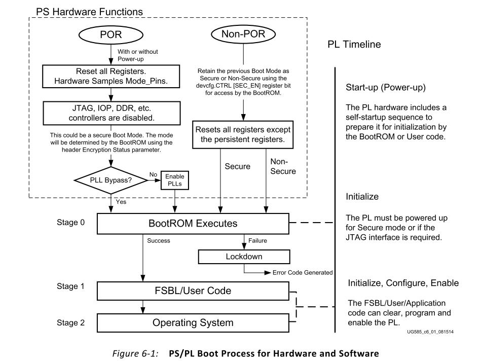
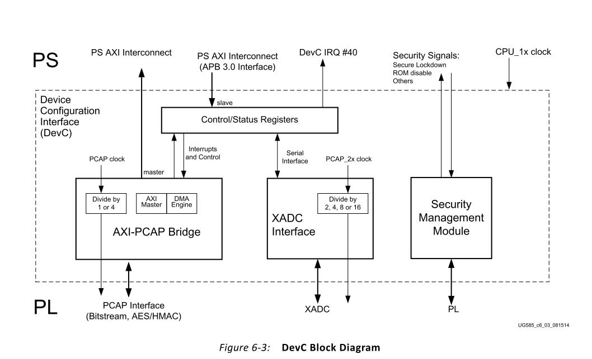

<!DOCTYPE html>
<!-- saved from url=(0056)http://kcmetercec.top/2018/11/08/processor_zynq_hd_boot/ -->
<html class="theme-next gemini use-motion" lang="en"><head><meta http-equiv="Content-Type" content="text/html; charset=UTF-8">

<meta http-equiv="X-UA-Compatible" content="IE=edge">
<meta name="viewport" content="width=device-width, initial-scale=1, maximum-scale=1">
<meta name="theme-color" content="#222">

<meta http-equiv="Cache-Control" content="no-transform">
<meta http-equiv="Cache-Control" content="no-siteapp">

  <meta name="google-site-verification" content="zLSyD2CN1AkyJqei3qKraT6372nBgMFKWe6kAj5JDeY">

  <link href="./zynq hardware -_ boot _ explorer_files/jquery.fancybox.css" rel="stylesheet" type="text/css">

<link href="./zynq hardware -_ boot _ explorer_files/font-awesome.min.css" rel="stylesheet" type="text/css">

<link href="./zynq hardware -_ boot _ explorer_files/main.css" rel="stylesheet" type="text/css">

  <link rel="apple-touch-icon" sizes="180x180" href="http://kcmetercec.top/images/apple-touch-icon-next.png?v=5.1.4">

  <link rel="icon" type="image/png" sizes="32x32" href="http://kcmetercec.top/images/favicon-32x32-next.png?v=5.1.4">

  <link rel="icon" type="image/png" sizes="16x16" href="http://kcmetercec.top/images/favicon-16x16-next.png?v=5.1.4">

  <link rel="mask-icon" href="http://kcmetercec.top/images/logo.svg?v=5.1.4" color="#222">

  <meta name="keywords" content="zynq,">

  <link rel="alternate" href="http://kcmetercec.top/atom.xml" title="explorer" type="application/atom+xml">

<meta name="description" content="&amp;#x6574;&amp;#x7406;zynq&amp;#x7684;&amp;#x786C;&amp;#x4EF6;&amp;#x542F;&amp;#x52A8;&amp;#x6D41;&amp;#x7A0B;&amp;#x3002;">
<meta name="keywords" content="zynq">
<meta property="og:type" content="article">
<meta property="og:title" content="zynq hardware -&gt; boot">
<meta property="og:url" content="http://kcmetercec.top/2018/11/08/processor_zynq_hd_boot/index.html">
<meta property="og:site_name" content="explorer">
<meta property="og:description" content="&amp;#x6574;&amp;#x7406;zynq&amp;#x7684;&amp;#x786C;&amp;#x4EF6;&amp;#x542F;&amp;#x52A8;&amp;#x6D41;&amp;#x7A0B;&amp;#x3002;">
<meta property="og:locale" content="en">
<meta property="og:image" content="https://github.com/KcMeterCEC/explore/blob/master/[processor]/[Zynq]/[What]Zynq--hardware/boot/boot.jpg?raw=true">
<meta property="og:image" content="https://github.com/KcMeterCEC/explore/blob/master/[processor]/[Zynq]/[What]Zynq--hardware/boot/pl_conf_path.jpg?raw=true">
<meta property="og:image" content="https://github.com/KcMeterCEC/explore/blob/master/[processor]/[Zynq]/[What]Zynq--hardware/boot/devc_struct.jpg?raw=true">
<meta property="og:image" content="https://github.com/KcMeterCEC/explore/blob/master/[processor]/[Zynq]/[What]Zynq--hardware/boot/power_requirements.jpg?raw=true">
<meta property="og:image" content="https://github.com/KcMeterCEC/explore/blob/master/[processor]/[Zynq]/[What]Zynq--hardware/boot/boot_mode.jpg?raw=true">
<meta property="og:image" content="https://github.com/KcMeterCEC/explore/blob/master/[processor]/[Zynq]/[What]Zynq--hardware/boot/bootrom_flow.jpg?raw=true">
<meta property="og:image" content="https://github.com/KcMeterCEC/explore/blob/master/[processor]/[Zynq]/[What]Zynq--hardware/boot/bootrom_header1.jpg?raw=true">
<meta property="og:image" content="https://github.com/KcMeterCEC/explore/blob/master/[processor]/[Zynq]/[What]Zynq--hardware/boot/bootrom_header2.jpg?raw=true">
<meta property="og:updated_time" content="2018-11-11T01:28:31.550Z">
<meta name="twitter:card" content="summary">
<meta name="twitter:title" content="zynq hardware -&gt; boot">
<meta name="twitter:description" content="&amp;#x6574;&amp;#x7406;zynq&amp;#x7684;&amp;#x786C;&amp;#x4EF6;&amp;#x542F;&amp;#x52A8;&amp;#x6D41;&amp;#x7A0B;&amp;#x3002;">
<meta name="twitter:image" content="https://github.com/KcMeterCEC/explore/blob/master/[processor]/[Zynq]/[What]Zynq--hardware/boot/boot.jpg?raw=true">

  <link rel="canonical" href="http://kcmetercec.top/2018/11/08/processor_zynq_hd_boot/">

  <title>zynq hardware -&gt; boot | explorer</title>

  

</head>

<body itemscope="" itemtype="http://schema.org/WebPage" lang="en">

  

    

    <header id="header" class="header" itemscope="" itemtype="http://schema.org/WPHeader">
      

  

    

      [
        
        explorer
        
      ](http://kcmetercec.top/)
    

万丈高楼平地起，勿在浮沙筑高台

  

  

    <button>
      
      
      
    </button>
  

<nav class="site-nav">

*   [

            Home
          ](http://kcmetercec.top/)
*   [

            About
          ](http://kcmetercec.top/about/)
*   [

            Tags
          ](http://kcmetercec.top/tags/)
*   [

            Categories
          ](http://kcmetercec.top/categories/)
*   [

            Archives
          ](http://kcmetercec.top/archives/)
*   [

            Search
          ](javascript:;)

    

  

  

    

    
    

    
    

      <input autocomplete="off" placeholder="Searching..." spellcheck="false" type="text" id="local-search-input">
    

  

  

    

</nav>

 

    </header>

    <main id="main" class="main">
      

        

          

  

  <article class="post post-type-normal" itemscope="" itemtype="http://schema.org/Article">

  

    <link itemprop="mainEntityOfPage" href="http://kcmetercec.top/2018/11/08/processor_zynq_hd_boot/">

    
      <meta itemprop="name" content="kcmetercec">
      <meta itemprop="description" content="">
      <meta itemprop="image" content="https://avatars3.githubusercontent.com/u/16881795?s=400&amp;u=f62971f44f59d17d823044e709d4668debec7c02&amp;v=4">
    

    
      <meta itemprop="name" content="explorer">
    

      <header class="post-header" style="opacity: 1; display: block; transform: translateY(0px);">

# zynq hardware -&gt; boot

        

          

              

              

                Posted on

              <time title="Post created" itemprop="dateCreated datePublished" datetime="2018-11-08T00:00:00+08:00">
                2018-11-08
              </time>

          

            

              |

              

              

                In

                
                  [
                    processor
                  ](http://kcmetercec.top/categories/processor/)
                

                  , 

                
                  [
                    zynq
                  ](http://kcmetercec.top/categories/processor/zynq/)
                

                  , 

                
                  [
                    hardware
                  ](http://kcmetercec.top/categories/processor/zynq/hardware/)
                

            

              
                |
                

                
                [
                  0
                ](http://kcmetercec.top/2018/11/08/processor_zynq_hd_boot/#comments)
              

             
               |
               

               

                 Visitors:

                 34
             

        

      </header>

    

        

整理zynq的硬件启动流程。

## 整体流程

### 概览

zynq的整体启动流程如下图:

*   除了以上的启动方式外，在调试阶段，可以通过JTAG接口以非安全模式下启动。

    *   这样JTAG才可以访问ARM debug access port(DAP)以及 Xilinx test access port(TAP) 来分别调试ARM和PL.
*   在安全模式下，代码是被事先加密过的，BootROM会通过DMA将fsbl读到OCM中后被CPU执行。

    *   在这中间会经过AES(Advanced Encryption Standard)/HMAC(Hash-based Message Authentication Code)单元进行解密。
*   在非安全模式下，BootROM根据包头来确定是否需要将fsbl拷贝到OCM中执行。
*   如果BootROM没有在设备到找到合法的软件包头，它会依次寻找，直到找到了或遍历完这个设备空间。

    *   只会在QSPI,NAND,NOR中这样做，在SD卡中如果失败了则不会寻找了。
*   PL启动分以下4个阶段:

    *   上电启动
    *   初始化:清空SRAM，准备烧写bit文件
    *   配置: 配置PS-PL接口
    *   使能: BOOTROM会读取PL的启动状态来确定何时使能PL端的JTAG。

### PS端硬件启动

PS端硬件启动包含上电时序、时钟获取、复位、启动管脚采样、PLL初始化。在PS启动时PL也可同时启动。

在PS启动后的几个时钟周期，它将会读取MIO2~8的配置模式并将配置存储到只读存储器中。

*   其中MIO6来决定是否使能PLL，如果使能了PLL，那么系统将要等待PLL稳定后才启动BOOTROM.

如果没有使能则会直接使用外部晶振的频率。

### PS端软件启动

PS段软件上整体流程为：

1.  BootROM根据启动引脚决定从哪个介质读出BOOT包

    *   在CPU0上运行，CPU1处于等待事件状态(WFE)
    *   BootROM是硬编码的代码，无法改变
2.  BootROM分析BOOT包头来确认是否要搬移代码到OCM
3.  运行FSBL或裸机代码

    *   FSBL 是完全可更改的
4.  运行SSBL或裸机代码或系统
5.  运行系统

### 启动介质的内容

通常的启动包包含下面的内容:

*   bootrom 头，用于bootrom分析
*   fsbl/裸机代码，用于bootrom搬移
*   PL端的bit文件，用于后续代码给PL烧写
*   ssbl/裸机代码/或系统，用于fsbl跳转到此执行

### 启动模式

zynq支持4种主动启动方式：

1.  QSPI

    *   可以选择是否直接在QSPI上执行代码，这样可以减少数据搬移而提高启动速度
2.  NOR

    *   可以选择是否直接在NOR上执行代码，这样可以减少数据搬移而提高启动速度
3.  SD卡
4.  NAND

可以在[AR#50991](https://www.xilinx.com/support/answers/50991.html)中挑选官方推荐的芯片。

zynq也支持被动启动方式，这种方式是非加密模式：

*   cascade JTAG模式，默认是这种方式

    *   可以通过PL JTAG访问DAP和TAP
*   独立 JTAG模式1

    *   使用PL JTAG访问TAP来控制PL
    *   在配置完PL后，使用EMIO JTAG来访问DAP控制ARM
*   独立 JTAG模式2

    *   使用PL JTAG访问TAP来控制PL
    *   使用MIO JTAG访问DAP来控制ARM

### BootROM的执行

根据前面的说明可以知道:

1.  系统热启动的情况下会很快执行BootROM，所以其启动时间更短。
2.  BootROM在主动启动模式下，具有对应控制器的初始化功能，这样才能读取介质内容。

BootROM的头来决定是否为安全启动模式，如果为安全启动模式，BootROM会将代码从flash读出、解密、写入OCM。

*   如果安全模式下热启动，头格式被非法修改为非安全模式，此时BootROM会停止锁死系统并报错 0x201A.

    *   报错码会写入寄存器 `slcr.REBOOT_STATUS`

### PL的配置路径

如上图所示PL有3种配置路径：

1.  JTAG连接TAP控制器

    *   用于非安全模式
    *   需要PL被配置于TAP接口
2.  PS PCAP 控制

    *   用于安全和非安全模式
    *   需要PL被配置于Devc接口
3.  ICAP控制

    *   用于安全和非安全模式
    *   需要PL已经被事先下载了bit流

### 设备配置接口

zynq具有3个设备接口(DevC, device configuration interface)来分别:

1.  配置PL
2.  管理设备安全性
3.  访问XADC

## 上电到bootrom

### 电源需求

在进入bootrom前，需要的电源需求如下图:

### 时钟

当使能PLL时，需确保外部晶振的稳定。当PLL旁路时系统运行速度会降低并且有些模块也无法使用（比如USB）。

### 复位

有以下两种复位：

*   POR Reset(冷启动复位):复位整个系统
*   Non-POR Resets(热启动复位):仅复位部分

### 启动模式管脚

在复位后硬件将会采样这几个管脚值，然后存储于只读寄存器:

*   BOOT_MODE[4:0] 存储于 `slcr.BOOT_MODE[BOOT_MODE],[PLL_BYPASS]` 中
*   VMODE[1:0] 存储于 `slcr.GPIOB_DRVR_BIAS_CTRL[RB_VCFG],[LB_VCFG]` 中

    *   VMODE[0] 控制MIO15:0管脚，VMODE[1]控制53:16管脚

## bootrom

*   bootrom在执行期间DAP和TAP是不可用的。
*   fsbl/user code 的大小限制在192k，但如果是在flash上直接运行则没有这个限制

    *   本来256k的OCM，有高64k在运行bootrom，所以bootrom在搬移fsbl代码期间只剩下192KB空间了。

### bootrom头

bootrom头只在flash启动下需要，在JTAG启动下不需要。

#### 中断向量表的存储位置(0x00 ~ 0x1c, 8个4字节)

当代码要运行在QSPI或NOR flash时，这部分空间用于存放ARM中的8种[异常中断](http://kcmetercec.top/2018/03/12/linux_kernel_irq_tutorial/#org622942e)。

#### 数据宽度检测(0x20)

当启动方式为QSPI时，此处内容必须为 `0xaa995566` 以告知bootrom可以检测数据宽度

#### 文件标识(0x24)

此处值恒定为 `0x584c4e58` 以对应字符串 "XLNX",以告知此文件为zynq的启动文件

#### 加密配置(0x28)

*   `0xa5c3c5a3` : fsbl/user code 已被加密，使用 eFUSE key
*   `0x3a5c3c5a` : fsbl/user code 已被加密，使用电源维持的 RAM key
*   其他值: 非加密模式

#### fsbl/user 定义区(0x2c)

此值可以被fsbl/user 所使用，bootrom并不使用

#### source offset(0x30)

指定源码相对文件起始位置的偏移，单位为字节。

*   此值必须是64字节对齐，并且位置不能小于 `0x8c0`

#### image长度(0x34)

指定文件长度，单位为字节。

*   当值为0时，bootrom不会拷贝代码到OCM中，而是直接在QSPI或NORflash上运行。

#### 保留(0x38)

值为0.

#### 执行的起始地址(0x3c)

指定代码的执行地址，必须64字节对齐。

#### image的总大小(0x40)

要载入OCM中的总大小。

*   在非安全模式下，此值与image长度一致
*   在安全模式下，此值会大于image长度

#### 保留(0x44)

值为0.

#### 头校验(0x48)

计算0x20~0x44之和，然后取反。

#### fsbl/user 定义区(0x4c ~ 0x9c)

此值可以被fsbl/user 所使用，bootrom并不使用

#### 寄存器初始化参数(0xa0~0x89f)

这里包含了256对 `地址，数据` 对，用于在启动fsbl/user code 之前先来初始化zynq.

*   当地址为 `0xffffffff` 或遍历到列表尾时，bootrom退出初始化

#### fsbl/user 定义区(0x8a0 ~ 0x8bf)

此值可以被fsbl/user 所使用，bootrom并不使用

#### 代码的起始地址(0x8c0)

代码地址必须存放于大于或等于此处，并且以64位对齐。

Last Updated 2018-11-12 Mon 08:04.
Render by [hexo-renderer-org](https://github.com/CodeFalling/hexo-renderer-org) with [Emacs](https://www.gnu.org/software/emacs/) 26.1 ([Org](https://orgmode.org/) mode 9.1.14)

    

    <footer class="post-footer">

        

            [# zynq](http://kcmetercec.top/tags/zynq/)

        

        

          

              [
                 [What]数据结构与算法 -&gt; 排序
              ](http://kcmetercec.top/2018/11/07/program_DS_sort/ "[What]数据结构与算法 -&gt; 排序")

          

          

          

              [
                zynq petalinux -&gt; boot 
              ](http://kcmetercec.top/2018/11/09/processor_zynq_petalinux_boot/ "zynq petalinux -&gt; boot")

          

        

    </footer>
  

  </article>

    

    

  

          

    

<input name="nick" placeholder="昵称" class="vnick vinput" type="text"><input name="mail" placeholder="邮箱" class="vmail vinput" type="email"><input name="link" placeholder="网址(http://)" class="vlink vinput" type="text">

<textarea id="veditor" class="veditor vinput" placeholder="Just go go"></textarea>
Emoji | Preview

_😀__😃__😄__ğŸ˜__😆__😅__😂__😊__😇__😉__😌__ğŸ˜__😘__😗__😙__😚__😋__😜__ğŸ˜__😛__ğŸ˜__ğŸ˜__😒__ğŸ˜__😔__😟__😕__😣__😖__😫__😩__😠__😡__😶__ğŸ˜__😑__😯__😦__😧__😮__😲__😵__😳__😱__😨__😰__😢__😥__😭__😓__😪__😴__😷__😈__😺__😸__😹__😻__😼__😽__🙀__😿__😾__🐱__🐭__🐮__🐵__✋__✊__✌️__👆__👇__👈__👉__👊__👋__ğŸ‘__ğŸ‘__ğŸ‘__ğŸ‘__👌__🙏__👂__👀__👃__👄__👅__❤️__💘__💖__⭐️__✨__⚡️__☀️__â˜ï¸__❄️__☔️__☕️__✈️__⚓️__⌚️__â˜ï¸__⌛️__✉️__✂️__✒️__✏️__❌__♻️__✅__❎__Ⓜ️__ℹ️__™️__©️__®️_

[<svg class="markdown" viewBox="0 0 16 16" version="1.1" width="16" height="16" aria-hidden="true"><path fill-rule="evenodd" d="M14.85 3H1.15C.52 3 0 3.52 0 4.15v7.69C0 12.48.52 13 1.15 13h13.69c.64 0 1.15-.52 1.15-1.15v-7.7C16 3.52 15.48 3 14.85 3zM9 11H7V8L5.5 9.92 4 8v3H2V5h2l1.5 2L7 5h2v6zm2.99.5L9.5 8H11V5h2v3h1.5l-2.51 3.5z"></path></svg>](https://segmentfault.com/markdown)

<button type="button" title="Cmd|Ctrl+Enter" class="vsubmit vbtn">回复</button>

快来做第一个评论的人吧~

Powered By [Valine](https://valine.js.org/)
v1.3.4

        

  

    

      
      
      
    

  

  <aside id="sidebar" class="sidebar" style="margin-top: 382px; margin-left: initial;">

    

*   Table of Contents
*   Overview

      <section class="site-overview-wrap sidebar-panel" style="">
        

          

              

kcmetercec

我的世界

          

          <nav class="site-state motion-element">

              

                [

                  160
                  posts
                ](http://kcmetercec.top/archives/)
              

              

                [
                  96
                  categories
                ](http://kcmetercec.top/categories/index.html)
              

              

                [
                  35
                  tags
                ](http://kcmetercec.top/tags/index.html)
              

          </nav>

            

              [

                RSS
              ](http://kcmetercec.top/atom.xml)
            

            

                  
                    [

                        GitHub](https://github.com/KcMeterCEC "GitHub")
                  

            

            

              [
                
              ](https://creativecommons.org/licenses/by-nc/4.0/)
            

        

      </section>

      <!--noindex-->
        <section class="post-toc-wrap motion-element sidebar-panel sidebar-panel-active">
          

              

1.  [1. 整体流程](http://kcmetercec.top/2018/11/08/processor_zynq_hd_boot/#orgc376886)

        1.  [1.1. 概览](http://kcmetercec.top/2018/11/08/processor_zynq_hd_boot/#orga0ede36)
    2.  [1.2. PS端硬件启动](http://kcmetercec.top/2018/11/08/processor_zynq_hd_boot/#orgb1772df)
    3.  [1.3. PS端软件启动](http://kcmetercec.top/2018/11/08/processor_zynq_hd_boot/#orgeb46b98)
    4.  [1.4. 启动介质的内容](http://kcmetercec.top/2018/11/08/processor_zynq_hd_boot/#orgf9d8e52)
    5.  [1.5. 启动模式](http://kcmetercec.top/2018/11/08/processor_zynq_hd_boot/#orgca9ffa1)
    6.  [1.6. BootROM的执行](http://kcmetercec.top/2018/11/08/processor_zynq_hd_boot/#orgf32c65e)
    7.  [1.7. PL的配置路径](http://kcmetercec.top/2018/11/08/processor_zynq_hd_boot/#orgec9270d)
    8.  [1.8. 设备配置接口](http://kcmetercec.top/2018/11/08/processor_zynq_hd_boot/#org722db8d)
2.  [2. 上电到bootrom](http://kcmetercec.top/2018/11/08/processor_zynq_hd_boot/#org39a8c70)

        1.  [2.1. 电源需求](http://kcmetercec.top/2018/11/08/processor_zynq_hd_boot/#org544f181)
    2.  [2.2. 时钟](http://kcmetercec.top/2018/11/08/processor_zynq_hd_boot/#org7938146)
    3.  [2.3. 复位](http://kcmetercec.top/2018/11/08/processor_zynq_hd_boot/#org5c10aa6)
    4.  [2.4. 启动模式管脚](http://kcmetercec.top/2018/11/08/processor_zynq_hd_boot/#orgb3da33f)
3.  [3. bootrom](http://kcmetercec.top/2018/11/08/processor_zynq_hd_boot/#org62e0a9c)

        1.  [3.1. bootrom头](http://kcmetercec.top/2018/11/08/processor_zynq_hd_boot/#orge16bef2)

                1.  [3.1.1. 中断向量表的存储位置(0x00 ~ 0x1c, 8个4字节)](http://kcmetercec.top/2018/11/08/processor_zynq_hd_boot/#org0badeb5)
        2.  [3.1.2. 数据宽度检测(0x20)](http://kcmetercec.top/2018/11/08/processor_zynq_hd_boot/#org0d11179)
        3.  [3.1.3. 文件标识(0x24)](http://kcmetercec.top/2018/11/08/processor_zynq_hd_boot/#orgaa19197)
        4.  [3.1.4. 加密配置(0x28)](http://kcmetercec.top/2018/11/08/processor_zynq_hd_boot/#orgc1f7329)
        5.  [3.1.5. fsbl/user 定义区(0x2c)](http://kcmetercec.top/2018/11/08/processor_zynq_hd_boot/#org260ac76)
        6.  [3.1.6. source offset(0x30)](http://kcmetercec.top/2018/11/08/processor_zynq_hd_boot/#orgd58c94c)
        7.  [3.1.7. image长度(0x34)](http://kcmetercec.top/2018/11/08/processor_zynq_hd_boot/#org9530e73)
        8.  [3.1.8. 保留(0x38)](http://kcmetercec.top/2018/11/08/processor_zynq_hd_boot/#orgc7b6d74)
        9.  [3.1.9. 执行的起始地址(0x3c)](http://kcmetercec.top/2018/11/08/processor_zynq_hd_boot/#orgbbcbad3)
        10.  [3.1.10. image的总大小(0x40)](http://kcmetercec.top/2018/11/08/processor_zynq_hd_boot/#org728c501)
        11.  [3.1.11. 保留(0x44)](http://kcmetercec.top/2018/11/08/processor_zynq_hd_boot/#orga3fc8f1)
        12.  [3.1.12. 头校验(0x48)](http://kcmetercec.top/2018/11/08/processor_zynq_hd_boot/#org080336f)
        13.  [3.1.13. fsbl/user 定义区(0x4c ~ 0x9c)](http://kcmetercec.top/2018/11/08/processor_zynq_hd_boot/#orga488f32)
        14.  [3.1.14. 寄存器初始化参数(0xa0~0x89f)](http://kcmetercec.top/2018/11/08/processor_zynq_hd_boot/#org7797685)
        15.  [3.1.15. fsbl/user 定义区(0x8a0 ~ 0x8bf)](http://kcmetercec.top/2018/11/08/processor_zynq_hd_boot/#orge4d9bb7)
        16.  [3.1.16. 代码的起始地址(0x8c0)](http://kcmetercec.top/2018/11/08/processor_zynq_hd_boot/#orgcf9b01a)

          

        </section>
      <!--/noindex-->

    

  </aside>

      

    </main>

    <footer id="footer" class="footer">
      

        
© 2018 — 2019
  

  
  kcmetercec

  |
  Hosted by [Coding Pages](https://pages.coding.me/)

  
Powered by [Hexo](https://hexo.io/)

  |

  
Theme — [NexT.Gemini](https://github.com/iissnan/hexo-theme-next) v5.1.4

  

    

      2835

    

    

      4512

    

      

    </footer>

      

      

  

    

    

    

    

    

    

  

  

  

  

  

  

  
  

  

  

  
  
  

</body></html>